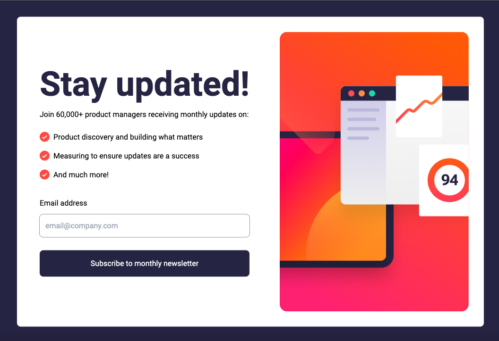
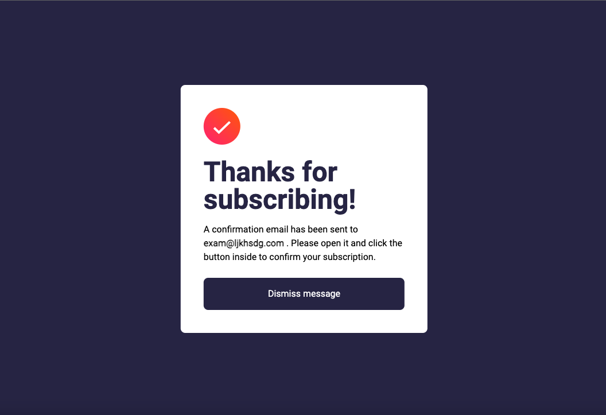
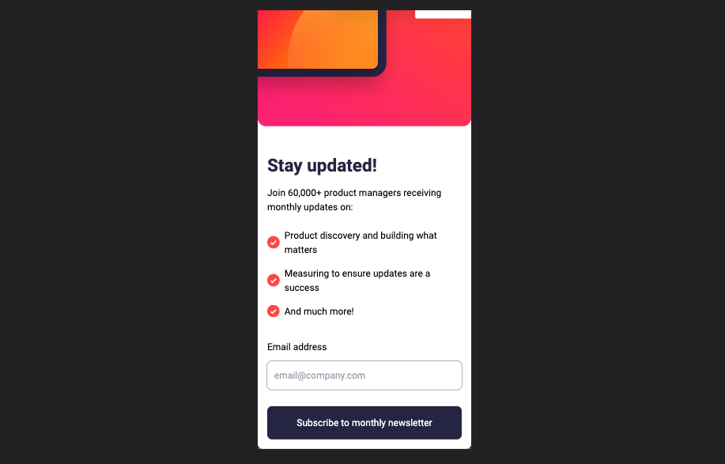
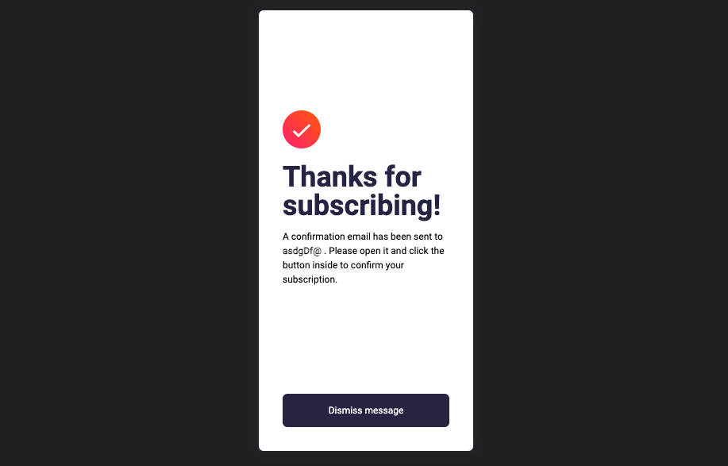

## Table of contents

- [Overview](#overview)
  - [The challenge](#the-challenge)
  - [Screenshot](#screenshot)
  - [Links](#links)
- [My process](#my-process)
  - [Built with](#built-with)
  - [Continued development](#continued-development)
  - [Useful resources](#useful-resources)
- [Author](#author)
- [Acknowledgments](#acknowledgments)

## Overview

### The challenge
Users should be able to:

- Add their email and submit the form
- See a success message with their email after successfully submitting the form
- See form validation messages if:
  - The field is left empty
  - The email address is not formatted correctly
- View the optimal layout for the interface depending on their device's screen size
- See hover and focus states for all interactive elements on the page

### Screenshot

Desktop:

Mobile:

### Links

- Solution URL: (https://github.com/alihaghjou/newsletter-challange)

## My process

### Built with

- [React](https://reactjs.org/) - JS library
- Vite
- Tailwindcss
- Flex
- Desktop First design

### Continued development

I want to continue designing with mobile app view because i am not used to designing responsive views.

### Useful resources

- [Resource 1](https://tailwindcss.com/) Tailwind docs helped with some custom styling for colors and responsive views.

## Author
- Frontend Mentor - [@alihaghjou](https://www.frontendmentor.io/profile/alihaghjou)
- Github - [alihaghjou](https://github.com/alihaghjou)